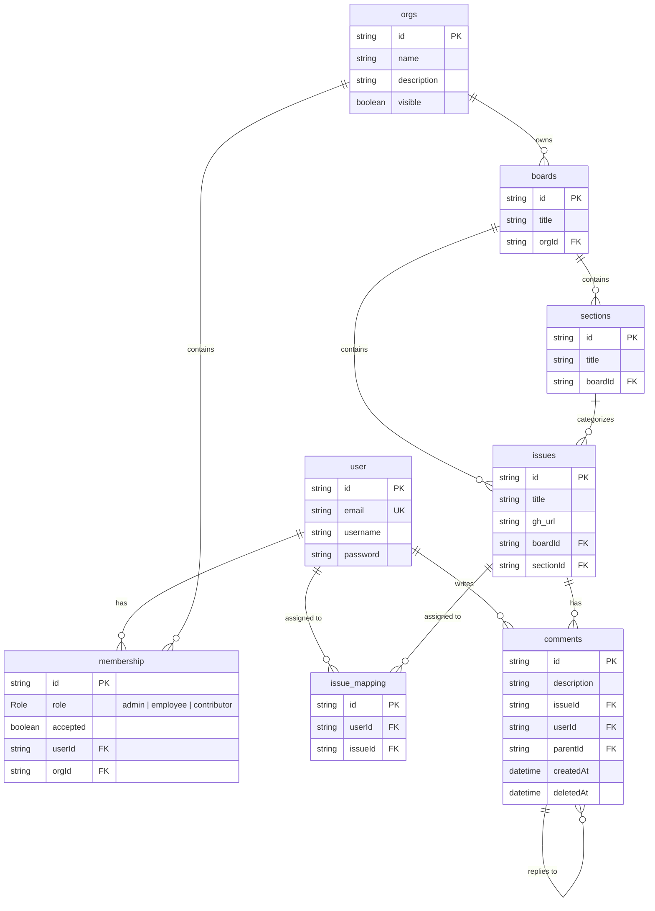

# 📋 Kanban Board (Trello Clone Monorepo)

A high-performance, real-time Kanban project management system built with **Bun**, **Turborepo**, **TypeScript**, **Express**, **Prisma**, and **PostgreSQL**.

Designed for agile teams and organizations, this platform provides hierarchical workspace management, dynamic Kanban boards, customizable workflow columns, issue tracking with GitHub integration, nested threaded discussions, and real-time collaboration.

---

## 🚀 Tech Stack

| Domain                        | Technologies                                                                                               |
| :---------------------------- | :--------------------------------------------------------------------------------------------------------- |
| **Runtime & Package Manager** | [Bun](https://bun.com/) (v1.3+)                                                                            |
| **Monorepo Engine**           | [Turborepo](https://turbo.build/repo) (v2)                                                                 |
| **Language**                  | [TypeScript](https://www.typescriptlang.org/) (Strict typing across all workspaces)                        |
| **Backend Framework**         | [Express 5](https://expressjs.com/) on Bun runtime                                                         |
| **Database & ORM**            | [PostgreSQL](https://www.postgresql.org/) with [Prisma ORM](https://www.prisma.io/) (`@prisma/adapter-pg`) |
| **Authentication & Security** | JWT (`jsonwebtoken`), `bcrypt` password hashing, Role-Based Access Control (RBAC)                          |
| **Validation**                | [Zod](https://zod.dev/) schema validation for requests and environment configurations                      |
| **Real-Time**                 | WebSockets (native Bun WebSocket server)                                                                   |
| **Testing**                   | Bun Test runner (`bun:test`), Supertest, custom integration test suites                                    |

---

## ✨ Features

### 🏢 Organization & Multi-Tenancy

- **Organization Workspaces**: Create, edit, and manage multiple team workspaces with custom visibility settings.
- **Role-Based Access Control (RBAC)**: Support for `admin`, `employee`, and `contributor` roles.
- **Invitation Lifecycle**: Seamless member invitations, role updates, and acceptance flows.

### 📊 Kanban Boards & Workflows

- **Dynamic Boards**: Create and organize multiple boards per organization.
- **Customizable Sections (Columns)**: Build flexible workflow pipelines (e.g., _Backlog_, _In Progress_, _In Review_, _Done_).
- **Column Lifecycle**: Reorder, rename, or safely delete sections with intelligent issue reassignment.

### 📝 Issue / Card Management

- **Rich Task Cards**: Create issues with descriptions, metadata, and optional GitHub links (`gh_url`).
- **Flexible Movement**: Move cards seamlessly across sections within the board.
- **Team Assignments**: Assign and unassign single or multiple team members to any card (`issue_mapping`).

### 💬 Threaded Discussion & Comments

- **Hierarchical Comment Tree**: Infinite-depth nested replies powered by an optimized recursive tree algorithm (`commentTree`).
- **Audit & Editing Policies**: 24-hour edit window enforcement and soft-deletion support.

### ⚡ Real-Time Synchronization & Performance

- **WebSocket Engine**: Real-time event broadcasting for instant board updates across active collaborators.
- **Optimized Database Indexing**: Composite indexes on `[boardId, sectionId]`, `[userId, orgId]`, and foreign key cascades.

---

## 🏗️ Repository Architecture

```text
trello/
├── apps/
│   ├── backend/         # Express 5 REST API server running on Bun
│   │   ├── src/
│   │   │   ├── controllers/  # Auth, Org, Board, Section, Issue, & Comment handlers
│   │   │   ├── helpers/      # Comment tree builder, async wrappers, custom error classes
│   │   │   ├── middlewares/  # JWT authentication & token generation
│   │   │   ├── models/       # Zod schemas for input validation
│   │   │   ├── routes/       # Express route definitions
│   │   │   └── types/        # TypeScript environment and entity typings
│   │   └── tests/            # Bun integration & unit test suite
│   ├── websockets/      # Real-time WebSocket server for collaborative sync
│   └── frontend/        # Kanban web application interface
│
├── packages/
│   ├── db/              # Prisma schema, migrations, and PostgreSQL client
│   │   ├── prisma/      # schema.prisma and migration logs
│   │   ├── scripts/     # Database utilities (e.g., clearDB.ts for test runs)
│   │   └── db.ts        # Prisma client instance with PostgreSQL adapter
│   ├── ui/              # Shared React component library
│   ├── eslint-config/   # Monorepo-wide ESLint configurations
│   └── typescript-config/ # Base and framework-specific tsconfig definitions
│
├── package.json         # Workspace root configuration
├── turbo.json           # Turborepo task pipeline definition
└── bun.lock             # Bun lockfile
```

---

## 🗄️ Data Model



---

## 📡 API Overview

All protected routes require a Bearer token in the `Authorization` header:
`Authorization: Bearer <jwt_token>`

### 🔐 Authentication & Profile

| Method | Endpoint           | Description                       | Access        |
| :----- | :----------------- | :-------------------------------- | :------------ |
| `POST` | `/api/auth/signup` | Register a new user               | Public        |
| `POST` | `/api/auth/login`  | Authenticate user and receive JWT | Public        |
| `GET`  | `/api/users/me`    | Fetch authenticated user profile  | Authenticated |

### 🏢 Organizations & Memberships

| Method   | Endpoint                   | Description                             | Access         |
| :------- | :------------------------- | :-------------------------------------- | :------------- |
| `GET`    | `/api/orgs`                | List all organizations for current user | Authenticated  |
| `POST`   | `/api/orgs`                | Create a new organization               | Authenticated  |
| `GET`    | `/api/orgs/:orgId`         | Get details of a specific organization  | Member         |
| `PUT`    | `/api/orgs/:orgId`         | Update organization details             | Org Admin      |
| `DELETE` | `/api/orgs/:orgId`         | Delete organization                     | Org Admin      |
| `GET`    | `/api/orgs/:orgId/members` | List members and their roles            | Member         |
| `POST`   | `/api/orgs/:orgId/members` | Invite a user to an organization        | Org Admin      |
| `PUT`    | `/api/orgs/:orgId/accept`  | Accept an organization invitation       | Invitee        |
| `PUT`    | `/api/orgs/:orgId/members` | Update a member's role                  | Org Admin      |
| `DELETE` | `/api/orgs/:orgId/members` | Remove user or leave organization       | Member / Admin |

### 📋 Boards

| Method   | Endpoint                  | Description                                | Access    |
| :------- | :------------------------ | :----------------------------------------- | :-------- |
| `GET`    | `/api/orgs/:orgId/boards` | List all boards in an organization         | Member    |
| `POST`   | `/api/orgs/:orgId/boards` | Create a new board                         | Member    |
| `GET`    | `/api/boards/:boardId`    | Get board details with sections and issues | Member    |
| `PUT`    | `/api/boards/:boardId`    | Rename / update board details              | Member    |
| `DELETE` | `/api/boards/:boardId`    | Delete board and associated data           | Org Admin |

### 📑 Sections (Columns)

| Method   | Endpoint                        | Description                                | Access    |
| :------- | :------------------------------ | :----------------------------------------- | :-------- |
| `GET`    | `/api/boards/:boardId/sections` | List sections for a board                  | Member    |
| `POST`   | `/api/boards/:boardId/sections` | Create a new section column                | Member    |
| `PUT`    | `/api/sections/:sectionId`      | Rename a section                           | Member    |
| `DELETE` | `/api/sections/:sectionId`      | Delete section (reassigns orphaned issues) | Org Admin |

### 📌 Issues (Cards) & Assignments

| Method   | Endpoint                          | Description                                   | Access |
| :------- | :-------------------------------- | :-------------------------------------------- | :----- |
| `GET`    | `/api/sections/:sectionId/issues` | List issues in a section                      | Member |
| `POST`   | `/api/sections/:sectionId/issues` | Create an issue (card)                        | Member |
| `GET`    | `/api/issues/:issueId`            | Get full issue detail                         | Member |
| `PUT`    | `/api/issues/:issueId`            | Update issue title or move to another section | Member |
| `DELETE` | `/api/issues/:issueId`            | Delete an issue                               | Member |
| `POST`   | `/api/issues/:issueId/assignees`  | Assign users to an issue                      | Member |
| `DELETE` | `/api/issues/:issueId/assignees`  | Remove user assignment                        | Member |

### 💬 Threaded Comments

| Method   | Endpoint                        | Description                                | Access         |
| :------- | :------------------------------ | :----------------------------------------- | :------------- |
| `GET`    | `/api/issues/:issueId/comments` | Get full nested comment tree for an issue  | Member         |
| `POST`   | `/api/issues/:issueId/comments` | Post a comment or reply to an existing one | Member         |
| `PUT`    | `/api/comments/:commentId`      | Edit a comment (within 24-hour limit)      | Author         |
| `DELETE` | `/api/comments/:commentId`      | Delete a comment                           | Author / Admin |

---

## 🛠️ Getting Started

### Prerequisites

- **[Bun](https://bun.com/)** (`>= 1.3.0`)
- **[Node.js](https://nodejs.org/)** (`>= 18.0.0`)
- **[PostgreSQL](https://www.postgresql.org/)** running locally or hosted

### 1. Clone & Install Dependencies

```bash
git clone <repository-url>
cd trello
bun install
```

### 2. Configure Environment Variables

Create `.env` files in `packages/db` and `apps/backend`:

**`packages/db/.env`**:

```env
DATABASE_URL="postgresql://<user>:<password>@localhost:5432/<database_name>"
```

**`apps/backend/.env`**:

```env
port="3000"
jwt_key="your-super-secret-jwt-key"
```

### 3. Setup the Database

Generate Prisma Client and apply migrations:

```bash
# From packages/db
bunx prisma migrate dev
bunx prisma generate
```

### 4. Run the Development Servers

Start all applications and packages concurrently with Turborepo:

```bash
bun turbo run dev
```

Or run individual services with filters:

```bash
# Start backend API only
bun run dev --filter=backend

# Start WebSocket server only
bun run dev --filter=websockets
```

---

## 🧪 Testing

The backend includes a comprehensive suite of unit tests and end-to-end integration tests using Bun's native test runner:

```bash
# Run all tests across the monorepo
bun turbo run test

# Run backend tests directly
bun test --cwd apps/backend
```

> [!NOTE]
> Integration tests automatically execute `packages/db/scripts/clearDB.ts` before runs to ensure a clean state in the test database (`trello_test`).

---

## 🗺️ Roadmap

- [x] Monorepo orchestration with Turborepo & Bun
- [x] Relational schema design with Prisma & PostgreSQL
- [x] Authentication & Role-Based Access Control (RBAC)
- [x] Multi-tenant organization & membership management
- [x] Board and workflow section (column) management
- [x] Issue lifecycle and cross-column card moves
- [x] Multi-user card assignments
- [x] Threaded nested comment tree with edit time limits
- [x] Comprehensive integration and unit test suite
- [ ] WebSocket broadcast events for live card drags and updates
- [ ] Next.js / React frontend UI with drag-and-drop Kanban board (`dnd-kit`)
- [ ] GitHub webhook integration for automated card syncing
- [ ] Card activity log and audit history
- [ ] File attachments & custom labels / tags
