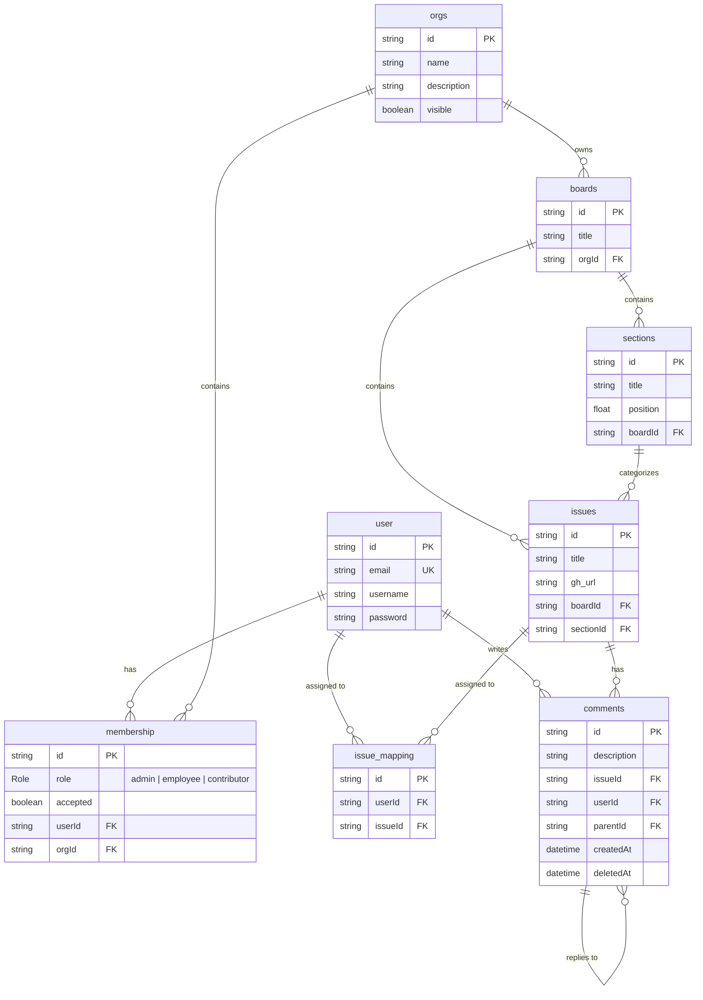

# 📋 Kanban Board (Trello Clone Monorepo)

A high-performance, real-time Kanban project management system built with **Bun**, **Turborepo**, **TypeScript**, **Express 5**, **Prisma ORM**, and **PostgreSQL**.

Designed for agile teams and organizations, this platform provides hierarchical workspace management, dynamic Kanban boards, customizable workflow columns, issue tracking with GitHub integration, nested threaded discussions, and a dedicated native **WebSocket engine** for real-time collaboration and presence tracking.

---

## 🚀 Tech Stack

| Domain                        | Technologies                                                                                                |
| :---------------------------- | :---------------------------------------------------------------------------------------------------------- |
| **Runtime & Package Manager** | [Bun](https://bun.com/) (v1.3+ / v1.4+)                                                                     |
| **Monorepo Engine**           | [Turborepo](https://turbo.build/repo) (v2)                                                                  |
| **Language**                  | [TypeScript](https://www.typescriptlang.org/) (Strict typing across all workspaces)                         |
| **Backend Framework**         | [Express 5](https://expressjs.com/) on Bun runtime                                                          |
| **Real-Time Engine**          | Native [Bun WebSockets](https://bun.com/docs/api/websockets) (Pub/Sub topics, room subscriptions, presence) |
| **Database & ORM**            | [PostgreSQL](https://www.postgresql.org/) with [Prisma ORM](https://www.prisma.io/) (`@prisma/adapter-pg`)  |
| **Authentication & Security** | JWT (`jsonwebtoken`), `bcrypt` password hashing, Role-Based Access Control (RBAC)                           |
| **Validation**                | [Zod](https://zod.dev/) schema validation for requests and environment configurations                       |
| **Testing**                   | Bun Test runner (`bun:test`), Supertest, custom integration & unit test suites                              |

---

## ✨ Features

### 🏢 Organization & Multi-Tenancy

- **Organization Workspaces**: Create, edit, and manage multiple team workspaces with custom visibility settings.
- **Role-Based Access Control (RBAC)**: Support for `admin`, `employee`, and `contributor` roles.
- **Invitation Lifecycle**: Seamless member invitations, role updates, and acceptance flows.

### 📊 Kanban Boards & Workflows

- **Dynamic Boards**: Create and organize multiple boards per organization.
- **Customizable Sections (Columns)**: Build flexible workflow pipelines (e.g., _Backlog_, _In Progress_, _In Review_, _Done_).
- **Column Lifecycle & Reordering**: Reorder, rename (`PUT` / `PATCH`), or safely delete sections. Column positions (`position`) are persisted to the database and indexed. Deleting a non-empty section requires specifying a `targetSectionId` on the same board to reassign issues; if a section is the only one remaining on the board and contains issues, deletion is blocked until issues are manually handled.

### 📝 Issue / Card Management

- **Rich Task Cards**: Create issues with descriptions, metadata, and optional GitHub links (`gh_url`).
- **Flexible Movement**: Move cards seamlessly across sections or reorder positions within a section (`PATCH /api/cards/:id/move`).
- **RESTful Card Aliases**: Full support for `/api/cards/*` routes alongside `/api/issues/*`.
- **Team Assignments**: Assign and unassign single or multiple team members to any card (`issue_mapping`).

### ⚡ Real-Time Collaboration & Presence (WebSockets)

- **Native Pub/Sub Engine**: Board-scoped rooms (`board_<boardId>`) using Bun's native high-performance WebSocket publish/subscribe.
- **Live Event Broadcasting**: Instant updates for card moves, creation, edits, deletions, and column changes.
- **Presence Tracking**: Real-time `user:joined` and `user:left` events with automatic connection-drop cleanup.
- **Flexible Authentication**: Handshake-level JWT validation supporting headers, cookies, URL query parameters, and subprotocols.
- **Dual-Server & IPC Architecture**: Supports running in unified single-process mode or separated microservices with HTTP broadcast bridging (`/internal/broadcast`).

### 💬 Threaded Discussions & Comments

- **Hierarchical Comment Tree**: Infinite-depth nested replies powered by an optimized recursive tree algorithm (`commentTree`).
- **Audit & Editing Policies**: 24-hour edit window enforcement and soft-deletion support.

### 🗄️ Database Optimization

- **Composite Indexing**: Optimized indexes on `[boardId, sectionId]`, `[userId, orgId]`, and foreign key cascades.
- **Prisma Client Generation**: Tailored output with PostgreSQL native pooling adapter.

---

## 🏗️ Repository Architecture

```text
trello/
├── apps/
│   ├── backend/               # Express 5 REST API server running on Bun
│   │   ├── src/
│   │   │   ├── controllers/   # Auth, Org, Board, Section, Issue, & Comment handlers
│   │   │   ├── helpers/       # Comment tree builder, async wrappers, custom error classes, JWT helpers
│   │   │   ├── middlewares/   # JWT authentication & token generation
│   │   │   ├── models/        # Zod schemas for input validation
│   │   │   ├── routes/        # Express route definitions (with card & section aliases)
│   │   │   ├── services/      # WebSocketBroadcaster client service
│   │   │   └── types/         # TypeScript environment and entity typings
│   │   └── tests/             # Integration & unit test suites (40+ unit tests)
│   │
│   ├── websockets/            # Native Bun WebSocket collaborative server
│   │   ├── src/
│   │   │   ├── auth/          # Handshake authentication & token extraction strategies
│   │   │   ├── server/        # Bun.serve WebSocket server, upgrade handlers, & close hooks
│   │   │   ├── services/      # Broadcaster singleton & IPC handler
│   │   │   └── types/         # Client actions, server events, & payload interfaces
│   │   ├── tests/             # WebSocket test suites (65 tests across auth, pub/sub, upgrade)
│   │   └── index.ts           # WebSocket entrypoint & dual-server runner
│   │
│   └── frontend/              # Kanban web application interface (in progress)
│
├── packages/
│   ├── db/                    # Prisma schema, migrations, and PostgreSQL client
│   │   ├── prisma/            # schema.prisma and migration logs
│   │   ├── scripts/           # Database utilities (clearDB.ts for test runs)
│   │   └── db.ts              # Prisma client instance with PostgreSQL adapter
│   ├── ui/                    # Shared React component library
│   ├── eslint-config/         # Monorepo-wide ESLint configurations
│   └── typescript-config/     # Base and framework-specific tsconfig definitions
│
├── package.json               # Workspace root configuration
├── turbo.json                 # Turborepo task pipeline definition
└── bun.lock                   # Bun lockfile
```

---

## 🗄️ Data Model



---

## 🌐 Real-Time WebSocket Protocol

The WebSocket server provides real-time event distribution and presence tracking across board collaborators.

### Connecting to WebSockets

- **Default URL**: `ws://localhost:3001`
- **Authentication**: JWT token must be provided through any of the following strategies:
  1. **Query Parameter**: `ws://localhost:3001?token=<JWT>` or `?access_token=<JWT>`
  2. **Authorization Header**: `Authorization: Bearer <JWT>`
  3. **Cookie**: `Cookie: token=<JWT>` or `auth_token=<JWT>`
  4. **Subprotocol**: `Sec-WebSocket-Protocol: bearer, <JWT>`

Unauthenticated connections are rejected at the HTTP handshake stage with **HTTP 401 Unauthorized**.

### Client-to-Server Actions

Send JSON frames over the WebSocket connection:

```jsonc
// 1. Join / Subscribe to a board room
{
  "action": "join", // or "subscribe"
  "boardId": "board-uuid"
}

// 2. Leave / Unsubscribe from a board room
{
  "action": "leave", // or "unsubscribe"
  "boardId": "board-uuid"
}

// 3. Heartbeat Ping
{
  "action": "ping"
}
```

### Server-to-Client Broadcast Events

When actions occur via REST API or other clients, events are published to the board room topic (`board_<boardId>`):

| Event Type       | Payload Fields                               | Description                              |
| :--------------- | :------------------------------------------- | :--------------------------------------- |
| `user:joined`    | `{ userId, name, email, boardId }`           | Collaborator entered the board           |
| `user:left`      | `{ userId, name, email, boardId }`           | Collaborator left or disconnected        |
| `card:created`   | `{ cardData: Issue }`                        | New card added to a column               |
| `card:updated`   | `{ cardId, updates: { title?, gh_url? } }`   | Card metadata or title modified          |
| `card:moved`     | `{ cardId, sourceList, destList, position }` | Card dragged across columns or reordered |
| `card:deleted`   | `{ cardId }`                                 | Card removed from the board              |
| `list:created`   | `{ listData: Section }`                      | New column added to the board            |
| `list:updated`   | `{ listId, title }`                          | Column renamed                           |
| `list:reordered` | `{ listId, newPosition }`                    | Column reordered                         |
| `list:deleted`   | `{ listId }`                                 | Column deleted                           |

### HTTP Endpoints on WebSocket Server

- `GET /health` or `GET /api/health`: Health status and port inspection.
- `POST /internal/broadcast`: Inter-process broadcast hook used by Express when running in multi-process mode. Authenticated via `x-internal-secret: <jwt_key>`.

---

## 📡 REST API Reference

All protected routes require a Bearer token in the `Authorization` header:
`Authorization: Bearer <jwt_token>`

### 🔐 Authentication & Profile

| Method | Endpoint           | Description                       | Access        |
| :----- | :----------------- | :-------------------------------- | :------------ |
| `POST` | `/api/auth/signup` | Register a new user               | Public        |
| `POST` | `/api/auth/login`  | Authenticate user and receive JWT | Public        |
| `GET`  | `/api/users/me`    | Fetch authenticated user profile  | Authenticated |

### 🏢 Organizations & Memberships

| Method   | Endpoint                   | Description                             | Access         |
| :------- | :------------------------- | :-------------------------------------- | :------------- |
| `GET`    | `/api/orgs`                | List all organizations for current user | Authenticated  |
| `POST`   | `/api/orgs`                | Create a new organization               | Authenticated  |
| `GET`    | `/api/orgs/:orgId`         | Get details of a specific organization  | Member         |
| `PUT`    | `/api/orgs/:orgId`         | Update organization details             | Org Admin      |
| `DELETE` | `/api/orgs/:orgId`         | Delete organization                     | Org Admin      |
| `GET`    | `/api/orgs/:orgId/members` | List members and their roles (Member only, 200 OK)             | Member         |
| `POST`   | `/api/orgs/:orgId/members` | Invite a user to an organization                               | Org Admin      |
| `PUT`    | `/api/orgs/:orgId/accept`  | Accept an organization invitation                              | Invitee        |
| `PUT`    | `/api/orgs/:orgId/members` | Update a member's role                                         | Org Admin      |
| `DELETE` | `/api/orgs/:orgId/members` | Remove user or leave organization                              | Member / Admin |

### 📋 Boards

| Method   | Endpoint                  | Description                                | Access    |
| :------- | :------------------------ | :----------------------------------------- | :-------- |
| `GET`    | `/api/orgs/:orgId/boards` | List all boards in an organization         | Member    |
| `POST`   | `/api/orgs/:orgId/boards` | Create a new board                         | Member    |
| `GET`    | `/api/boards/:boardId`    | Get board details with sections and issues | Member    |
| `PUT`    | `/api/boards/:boardId`    | Rename / update board details              | Member    |
| `DELETE` | `/api/boards/:boardId`    | Delete board and associated data           | Org Admin |

### 📑 Sections (Columns)

| Method          | Endpoint                        | Description                                                                                     | Access    |
| :-------------- | :------------------------------ | :---------------------------------------------------------------------------------------------- | :-------- |
| `GET`           | `/api/boards/:boardId/sections` | List sections for a board (sorted by `position`)                                                | Member    |
| `POST`          | `/api/boards/:boardId/sections` | Create a new section column (`list:created`, optional `position`)                               | Member    |
| `PUT` / `PATCH` | `/api/sections/:sectionId`      | Rename (`title`) or reorder (`position` / `newPosition`) with DB persistence (`list:updated` / `list:reordered`) | Member    |
| `DELETE`        | `/api/sections/:sectionId`      | Delete section; requires `targetSectionId` if section has issues (`list:deleted`)                | Org Admin |

### 📌 Issues (Cards) & Assignments

| Method          | Endpoint                                                              | Description                                                                     | Access |
| :-------------- | :-------------------------------------------------------------------- | :------------------------------------------------------------------------------ | :----- |
| `GET`           | `/api/sections/:sectionId/issues`<br>`/api/sections/:sectionId/cards` | List cards in a section                                                         | Member |
| `POST`          | `/api/sections/:sectionId/issues`<br>`/api/sections/:sectionId/cards` | Create a card; verifies section belongs to the board (`card:created`)            | Member |
| `GET`           | `/api/issues/:issueId`<br>`/api/cards/:issueId` / `:id`               | Get full card details                                                           | Member |
| `PUT` / `PATCH` | `/api/issues/:issueId`<br>`/api/cards/:issueId` / `:id`               | Update card title, GitHub URL, or section                        | Member |
| `PATCH`         | `/api/cards/:issueId/move`<br>`/api/cards/:id/move`                   | Explicitly move card across sections or positions (`card:moved`) | Member |
| `DELETE`        | `/api/issues/:issueId`<br>`/api/cards/:issueId` / `:id`               | Delete card (`card:deleted`)                                     | Member |
| `POST`          | `/api/issues/:issueId/assignees`                                      | Assign users to card                                             | Member |
| `DELETE`        | `/api/issues/:issueId/assignees`                                      | Remove user assignment                                           | Member |

### 💬 Threaded Comments

| Method   | Endpoint                        | Description                                | Access         |
| :------- | :------------------------------ | :----------------------------------------- | :------------- |
| `GET`    | `/api/issues/:issueId/comments` | Get nested comment tree for an issue       | Member         |
| `POST`   | `/api/issues/:issueId/comments` | Post a comment or reply to an existing one | Member         |
| `PUT`    | `/api/comments/:commentId`      | Edit a comment (within 24-hour limit)      | Author         |
| `DELETE` | `/api/comments/:commentId`      | Delete a comment                           | Author / Admin |

---

## 🛠️ Getting Started

### Prerequisites

- **[Bun](https://bun.com/)** (`>= 1.3.0`)
- **[Node.js](https://nodejs.org/)** (`>= 18.0.0`)
- **[PostgreSQL](https://www.postgresql.org/)** running locally or hosted

### 1. Clone & Install Dependencies

```bash
git clone <repository-url>
cd trello
bun install
```

### 2. Configure Environment Variables

Create `.env` configuration files:

**`packages/db/.env`**:

```env
DATABASE_URL="postgresql://<user>:<password>@localhost:5432/<database_name>"
```

**`apps/backend/.env`**:

```env
port="3000"
jwt_key="your-super-secret-jwt-key"
ws_port="3001"
```

**`apps/websockets/.env`**:

```env
ws_port="3001"
jwt_key="your-super-secret-jwt-key"
```

> [!IMPORTANT]
> The `jwt_key` in `apps/backend/.env` and `apps/websockets/.env` must match so that tokens generated by the REST API can be validated by the WebSocket server and inter-process broadcast calls can be authenticated.

### 3. Setup the Database

Generate Prisma Client and apply migrations:

```bash
# Apply migrations and generate Prisma client
bun --filter db exec prisma migrate dev
bun --filter db exec prisma generate
```

### 4. Run Development Servers

#### Option A: Run All Services via Turborepo (Recommended)

```bash
bun run dev
```

#### Option B: Run Specific Services Separately

```bash
# Start backend API (Port 3000)
bun run dev --filter=backend

# Start WebSocket server (Port 3001)
bun run dev --filter=websockets
```

#### Option C: Dual-Server Single-Process Mode

Run both Express API and native WebSockets within the same Bun process for shared in-memory broadcasting:

```bash
cd apps/websockets
START_EXPRESS=true bun run index.ts
```

---

## 🧪 Testing

The repository features comprehensive automated testing using Bun's native test runner (`bun:test`):

```bash
# 1. Run all tests across the monorepo
bun run test

# 2. Run WebSocket unit and integration tests (65 tests)
bun test --cwd apps/websockets

# 3. Run Backend unit tests (helpers, middleware, Zod schemas, & broadcast dispatches)
bun test apps/backend/tests/unit

# 4. Run Full Backend integration tests (requires PostgreSQL test database)
bun test --cwd apps/backend

# 5. Type check all monorepo packages
bun run check-types
```

> [!NOTE]
> Database integration tests depend on `packages/db/scripts/clearDB.ts` (configured in `turbo.json`) to automatically truncate tables before runs in the test database (`trello_test`).

---

## 🗺️ Roadmap

- [x] Monorepo orchestration with Turborepo & Bun
- [x] Relational schema design with Prisma & PostgreSQL
- [x] Authentication & Role-Based Access Control (RBAC)
- [x] Multi-tenant organization & membership management
- [x] Board and workflow section (column) management
- [x] Issue lifecycle, movement across columns, and position reordering
- [x] RESTful Card and Section aliases (`/api/cards/*`, `PATCH /move`)
- [x] Multi-user card assignments (`issue_mapping`)
- [x] Threaded nested comment tree with edit time limits
- [x] Native WebSocket server with board pub/sub rooms
- [x] Multi-strategy handshake authentication (Headers, Cookies, Query, Subprotocol)
- [x] Real-time presence tracking (`user:joined`, `user:left`)
- [x] Automatic WebSocket disconnect cleanup
- [x] Inter-process event synchronization (`WebSocketBroadcaster` with HTTP bridge)
- [x] Comprehensive test suites (65 WebSocket tests + 40 Backend unit tests)
- [ ] Next.js / React frontend UI with drag-and-drop Kanban board (`dnd-kit`)
- [ ] GitHub webhook integration for automated card syncing
- [ ] Card activity log and audit history
- [ ] File attachments & custom labels / tags
